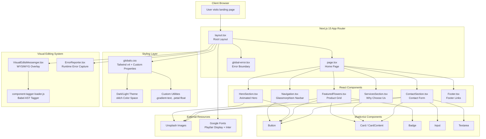

<div align="center">

# Flower Shop Landing Page

A modern, responsive flower shop landing page built with **Next.js 15**, **React 19**, **TypeScript**, and **Tailwind CSS v4**. Features a beautiful gradient-themed design with dark mode support, interactive product cards, and a contact form.

[](https://nextjs.org/)
[](https://react.dev/)
[](https://www.typescriptlang.org/)
[](https://tailwindcss.com/)
[](#license)

</div>

---

## Table of Contents

- [Features](#features)
- [Dev Stack](#dev-stack)
- [System Architecture](#system-architecture)
- [Project Structure](#project-structure)
- [Getting Started](#getting-started)
- [Available Scripts](#available-scripts)
- [Configuration](#configuration)
- [Components Overview](#components-overview)
- [Stats](#stats)
- [Author](#author)
- [License](#license)

---

## Features

### Core Features

- **Responsive Design** -- Fully responsive across mobile, tablet, and desktop breakpoints
- **Dark Mode** -- Built-in dark/light theme toggle using CSS custom properties with `oklch` color space
- **Glassmorphism Navigation** -- Fixed top navbar with `backdrop-blur-lg` and semi-transparent background
- **Animated Hero Section** -- Full-viewport gradient hero with floating decorative blobs and CSS keyframe animations
- **Interactive Product Grid** -- 6 flower products with hover zoom effects, favorite toggle, and add-to-cart buttons
- **Services Showcase** -- 4 service cards highlighting delivery, custom arrangements, same-day delivery, and freshness guarantee
- **Contact Form** -- Functional contact form with name, email, and message fields
- **Footer with Social Links** -- 4-column footer with brand info, quick links, shop categories, and support links

### UI/UX Highlights

- **Gradient Text Effects** -- Pink-to-purple gradient applied to headings using custom `.gradient-text` utility
- **Floating Animations** -- Decorative blobs animate with custom `petal-float` CSS keyframes
- **Card Hover Effects** -- Shadow and border transitions on product and service cards
- **Smooth Scrolling** -- Anchor-based navigation with smooth scroll to page sections
- **Mobile Hamburger Menu** -- Slide-down responsive navigation panel for smaller screens
- **Premium Quality Badge** -- Floating overlay card on the hero image
- **Statistics Bar** -- Displays 500+ Happy Customers, 100+ Flower Varieties, 24/7 Support

### Technical Features

- **Turbopack** -- Lightning-fast development builds with Next.js Turbopack
- **shadcn/ui Components** -- 57 pre-built UI components available (New York style)
- **Visual Editing System** -- Orchids visual editing overlay for WYSIWYG component editing in iframe
- **Error Boundary** -- Global error reporting with `ErrorReporter` component
- **Type Safety** -- Full TypeScript with strict mode enabled
- **Path Aliases** -- `@/*` maps to `./src/*` for clean imports

---

## Dev Stack

| Category | Technology | Version |
|---|---|---|
| **Framework** | Next.js (App Router) | 15.3.5 |
| **UI Library** | React / React DOM | 19.0.0 |
| **Language** | TypeScript | 5.x |
| **Styling** | Tailwind CSS | v4 |
| **CSS Processing** | PostCSS + `@tailwindcss/postcss` | -- |
| **Component Library** | shadcn/ui (New York) | Latest |
| **UI Primitives** | Radix UI | 22+ packages |
| **Icons** | Lucide React | Latest |
| **Animations** | Framer Motion / Motion | 12.23.22 |
| **Class Utilities** | tailwind-merge, clsx, CVA | Latest |
| **Bundler** | Turbopack (dev) | Built-in |
| **Package Manager** | Bun / npm | -- |
| **Linting** | ESLint + Next.js config | Latest |

### Installed (Available for Expansion)

| Category | Technology |
|---|---|
| **3D Graphics** | Three.js, @react-three/fiber, @react-three/drei |
| **Particles** | @tsparticles/react, @tsparticles/slim |
| **Carousels** | Swiper, embla-carousel-react |
| **Authentication** | better-auth, bcrypt |
| **Database** | Drizzle ORM, @libsql/client |
| **Payments** | Stripe |
| **Forms** | react-hook-form, @hookform/resolvers, zod |
| **Charts** | Recharts |
| **Globe/Maps** | cobe, three-globe, dotted-map |
| **Dark Mode** | next-themes |
| **Toasts** | sonner |
| **Marquee** | react-fast-marquee |

---

## System Architecture



---

## Project Structure

```
flower-shop-landing-page/
├── components.json              # shadcn/ui configuration
├── eslint.config.mjs            # ESLint configuration
├── next.config.ts               # Next.js configuration
├── postcss.config.mjs           # PostCSS (Tailwind v4)
├── tsconfig.json                # TypeScript configuration
├── package.json                 # Dependencies & scripts
├── public/                      # Static assets
│   ├── file.svg
│   ├── globe.svg
│   ├── next.svg
│   ├── vercel.svg
│   └── window.svg
└── src/
    ├── app/
    │   ├── favicon.ico
    │   ├── global-error.tsx     # Global error boundary
    │   ├── globals.css          # Tailwind v4 + theme variables
    │   ├── layout.tsx           # Root layout with fonts
    │   └── page.tsx             # Home page (assembles all sections)
    ├── components/
    │   ├── ContactSection.tsx   # Contact form & info
    │   ├── ErrorReporter.tsx    # Runtime error capture
    │   ├── FeaturedFlowers.tsx  # Product grid (6 flowers)
    │   ├── Footer.tsx           # 4-column footer
    │   ├── HeroSection.tsx      # Animated hero with stats
    │   ├── Navigation.tsx       # Glassmorphism navbar
    │   ├── ServicesSection.tsx  # 4 service cards
    │   └── ui/                  # 57 shadcn/ui components
    ├── hooks/
    │   └── use-mobile.ts        # Mobile breakpoint hook
    ├── lib/
    │   ├── utils.ts             # cn() class name utility
    │   └── hooks/
    │       └── use-mobile.tsx   # Duplicate mobile hook
    └── visual-edits/
        ├── component-tagger-loader.js  # Babel AST tagger
        └── VisualEditsMessenger.tsx    # WYSIWYG editing overlay
```

---

## Getting Started

### Prerequisites

- **Node.js** 18.17 or later
- **Bun** (recommended) or npm/yarn/pnpm

### Installation

```bash
# Clone the repository
git clone https://github.com/girishlade111/flower-shop-landing-page.git
cd flower-shop-landing-page

# Install dependencies (Bun recommended)
bun install
# or
npm install

# Start development server with Turbopack
bun dev
# or
npm run dev
```

Open [http://localhost:3000](http://localhost:3000) in your browser to see the result.

### Quick Start

```bash
bun dev --turbopack
```

The page auto-updates as you edit files. Start by modifying `src/app/page.tsx`.

---

## Available Scripts

| Command | Description |
|---|---|
| `bun dev` | Start dev server with **Turbopack** |
| `bun build` | Create production build |
| `bun start` | Start production server |
| `bun lint` | Run ESLint |

---

## Configuration

### Next.js (`next.config.ts`)

- **Remote Images** -- Allows all HTTPS/HTTP hostnames for Unsplash images
- **Turbopack** -- Custom JSX/TSX loader for component tagging
- **Build** -- TypeScript and ESLint errors ignored during builds

### TypeScript (`tsconfig.json`)

- **Target:** ES2017
- **Module:** ESNext with bundler resolution
- **Strict Mode:** Enabled
- **Path Alias:** `@/*` -> `./src/*`
- **JSX:** Preserve (handled by Next.js)

### Tailwind CSS (`globals.css`)

- **Version:** v4 with `@import "tailwindcss"` syntax
- **Custom Fonts:** Playfair Display (serif headings), Inter (sans-serif body), Geist
- **Theme:** Full light/dark mode using `oklch` color space CSS custom properties
- **Custom Utilities:** `.flower-shadow`, `.petal-float`, `.gradient-text`

### shadcn/ui (`components.json`)

- **Style:** New York
- **RSC:** Enabled
- **Base Color:** Neutral
- **Icon Library:** Lucide
- **CSS Variables:** Enabled

### ESLint (`eslint.config.mjs`)

- Extends Next.js recommended config
- Import plugin with rules for: no-unresolved, named, default, namespace, no-absolute-path, no-cycle
- Relaxed rules: unused vars, no-explicit-any, exhaustive-deps, unescaped-entities

---

## Components Overview

### Navigation (`Navigation.tsx`)

- Fixed glassmorphism navbar with `backdrop-blur-lg`
- Logo with gradient Flower2 icon from Lucide
- Desktop links: Home, Collection, Services, Contact
- Cart icon with badge counter
- "Shop Now" CTA button
- Responsive mobile hamburger menu

### Hero Section (`HeroSection.tsx`)

- Full-viewport gradient background (pink-rose-purple)
- Animated floating blobs with `petal-float` keyframes
- "Fresh Blooms Daily" badge with sparkle icon
- Gradient headline: "Blooming Moments of Joy"
- Two CTAs: "Shop Collection" and "Custom Orders"
- Stats: 500+ Customers, 100+ Varieties, 24/7 Support
- Hero image with floating "Premium Quality" overlay

### Featured Flowers (`FeaturedFlowers.tsx`)

- 6 products in responsive grid (1/2/3 columns)
- Products: Rose Elegance ($45), Sunflower Delight ($38), Tulip Paradise ($42), Orchid Luxe ($55), Lavender Dreams ($35), Lily Bouquet ($48)
- Hover zoom, favorite toggle, "Popular" badge, "Add to Cart" button

### Services Section (`ServicesSection.tsx`)

- 4 service cards: Free Delivery, Custom Arrangements, Same Day Delivery, Fresh Guarantee
- Icons in gradient circles with hover effects

### Contact Section (`ContactSection.tsx`)

- Two-column layout: contact info + form
- Contact cards: Email, Instagram, GitHub
- Form fields: Name, Email, Message
- Shop image overlay with "Visit Our Shop"

### Footer (`Footer.tsx`)

- 4-column grid: Brand, Quick Links, Shop, Support
- Social links: Email, Instagram, GitHub
- "Built by LadeStack" attribution

---

## Stats

| Metric | Value |
|---|---|
| **Components** | 7 custom + 57 shadcn/ui |
| **Products Displayed** | 6 flower arrangements |
| **Sections** | 6 (Nav, Hero, Products, Services, Contact, Footer) |
| **Radix UI Packages** | 22+ |
| **Theme Support** | Light + Dark (oklch) |
| **Responsive Breakpoints** | Mobile, Tablet, Desktop |
| **External Images** | Unsplash CDN |
| **Animation Libraries** | Framer Motion, CSS Keyframes |

---

## Author

**Girish Lade** -- LadeStack

- Website: [ladestack.in](https://ladestack.in)
- Email: girish@ladestack.in
- Instagram: [@girish_lade_](https://instagram.com/girish_lade_)
- GitHub: [@girishlade111](https://github.com/girishlade111)

---

## License

This project is licensed under the **MIT License**.

---

<div align="center">

**Built with care by [LadeStack](https://ladestack.in)**

</div>

**Built by Girish Lade** — [LadeStack](https://ladestack.in)
